# Story for goodreads

In the quiet realm of literary discovery, a treasure trove of data lay waiting, beckoning readers and authors alike to dive deep into the world of books. The dataset known as 'goodreads' housed a fascinating collection of insights from 10,000 titles, revealing the patterns and preferences of an ever-evolving reading community.

As the sun cast its golden glow over a cozy library, a curious researcher named Elara initiated her exploration of the dataset. With every transaction, she unearthed glimpses of the written word’s profound impact on society, the intersections of taste, and the allure of storytelling's vibrant tapestry.

The first revelation came in the form of numbers—a robust summary of the dataset’s structure. With 10,000 rows and 23 columns, each entry represented a unique book, a world unto itself. Elara marveled at the sheer diversity, noting that despite some missing data—specifically in ISBNs and original publication years—the essence of literature remained omnipresent.

Elara delved deeper into the numerical summary, where a striking average rating whispered tales of reader satisfaction. At 4.00 out of 5, the books revealed a community of recommenders, individuals willing to champion a title long after closing its cover. As she perused the ratings, she noted that while the highest-rated book soared to 4.82, the lowest anchored at 2.47. This spectrum prompted Elara to ponder how differing tastes and preferences molded the literary landscape. What stories lay behind these ratings? 

She also stumbled upon the curious case of book counts—titles ranged dramatically, with some authors boasting as many as 3,455 works. With an average of 75.7 books per title, certain authors had clearly captured the imaginations of their audiences, while others were deliriously prolific. Who were these wordsmiths weaving intricate tales? 

In her explorations, Elara discovered the names that resonated most within the dataset. Masters like Stephen King, Nora Roberts, and Agatha Christie emerged as ubiquitous forces in the literary world, their works becoming touchstones for readers worldwide. The allure of a well-spun narrative shone brightly in their catalogues, and Elara imagined readers seeking refuge between the pages, wrapped in suspense and delight.

The numerical intricacies continued to reveal that not all stories found their audiences easily—certain books lingered in obscurity, their ISBNs whispering echoes of forgotten plots and lost potential. But the mystery, too, acted as a siren’s call; readers often found joy in unearthing hidden gems, elevating lesser-known authors into the limelight through word of mouth, recommendation, and social media buzz.

Elara pondered over the implications of language, as she noted over a thousand entries were marred by missing language codes. She envisioned non-English speakers navigating the choppy seas of translations, seeking universality where words faltered. What stories were barred from access because of language barriers, and what treasures would be discovered if they were freed?

As she distilled her thoughts, she understood the power of collective readings and ratings. This dataset was not simply a collection of digits and titles; it was alive, breathing with the community’s shared experiences, their joys, sorrows, and the unforgettable moments locked within printed pages. It painted a portrait of humanity—a tapestry woven with threads of happiness, tension, nostalgia, and exploration.

Elara closed her laptop, her heart brewing with inspiration as the shadows of the evening stretched across her library. The ‘goodreads’ dataset was not merely an analysis of numbers; it was a treasure map documenting the rich landscape of human imagination. With each book, there lay a unique journey waiting to unfold, and she felt empowered, knowing that through her work, she could connect authors and readers, igniting new dialogues in the timeless conversation about literature.

And so, as the stars twinkled outside, Elara committed herself to be a storyteller—not just of narratives written within book covers, but also of the untold stories hidden in the folds of data, eager to intertwine once more with the hearts of those seeking adventure within their pages.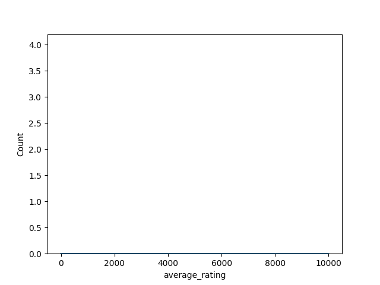
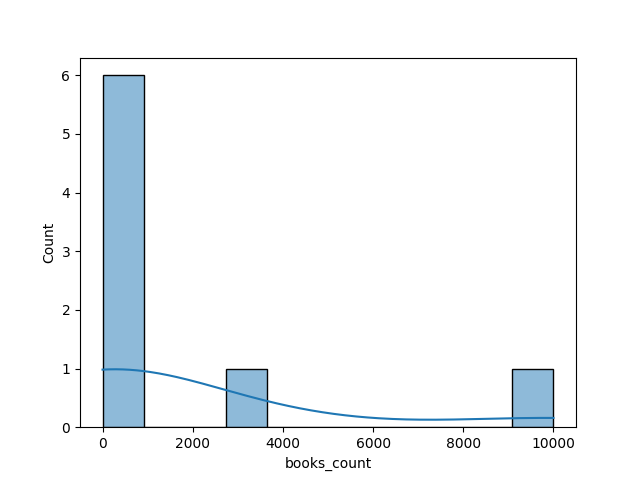
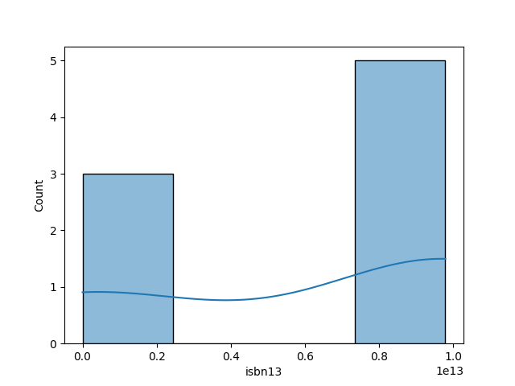
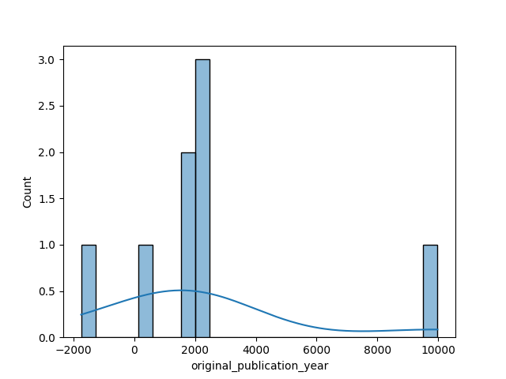
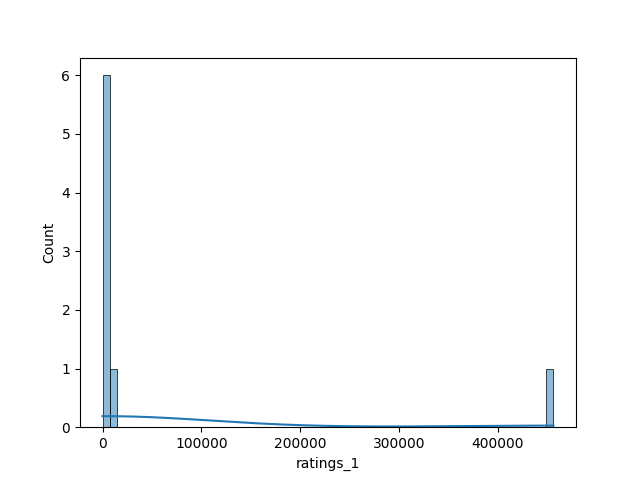
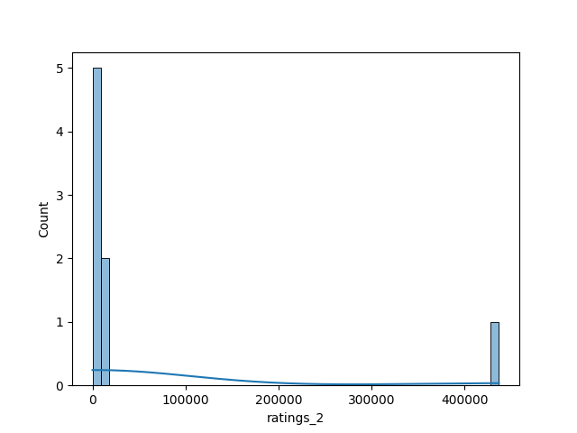
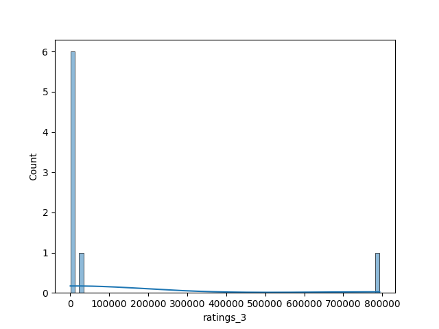
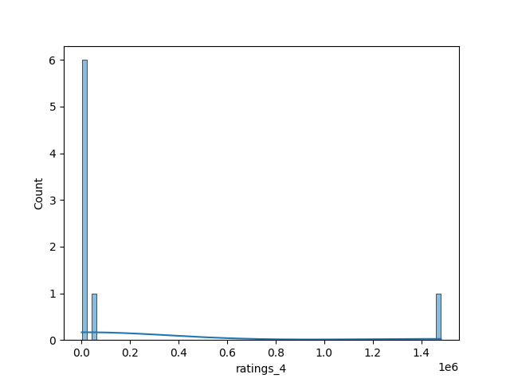
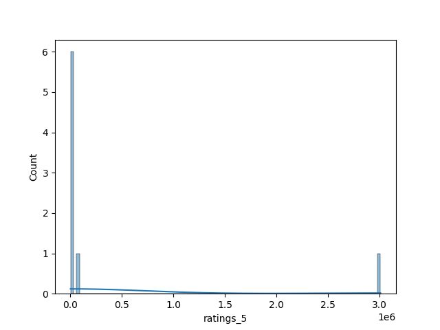

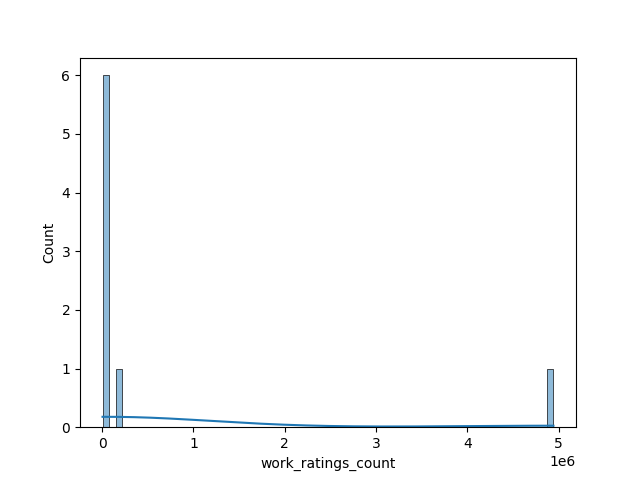
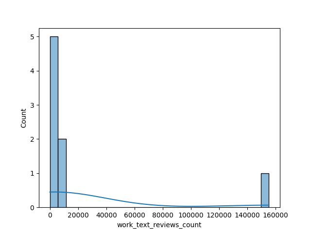
