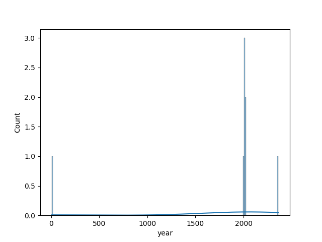
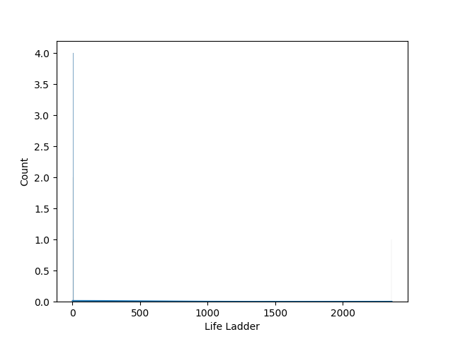
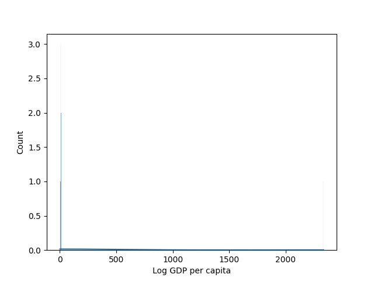
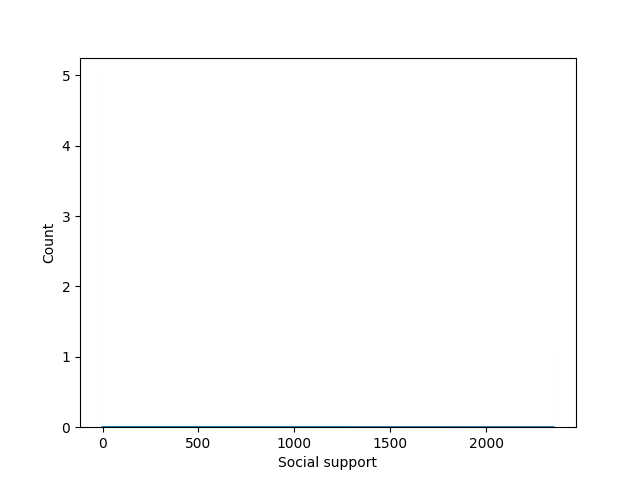
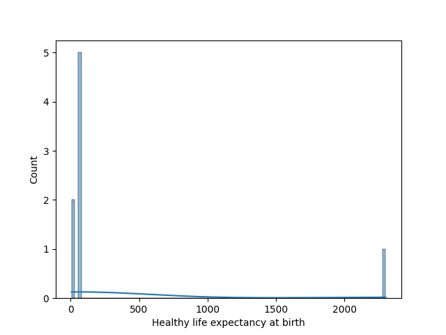
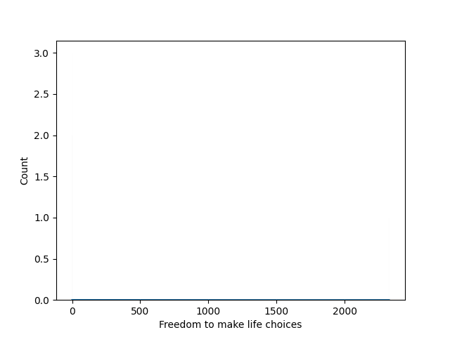
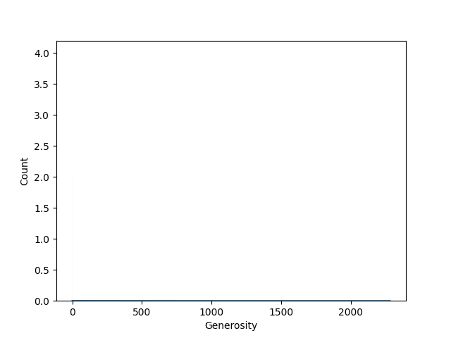
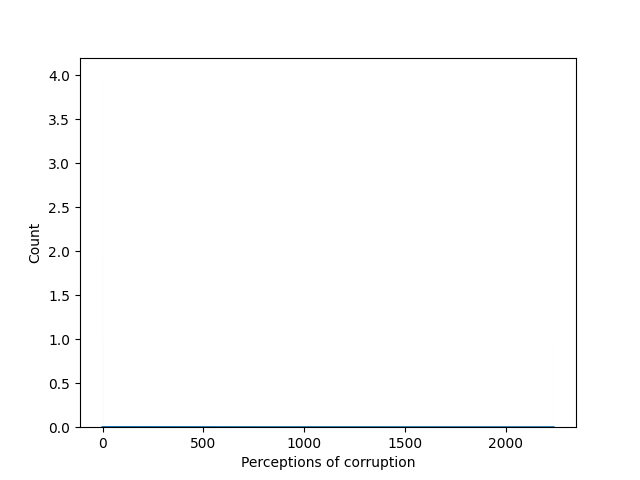
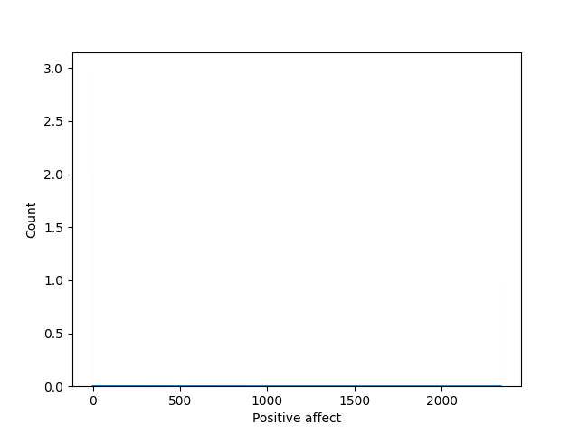
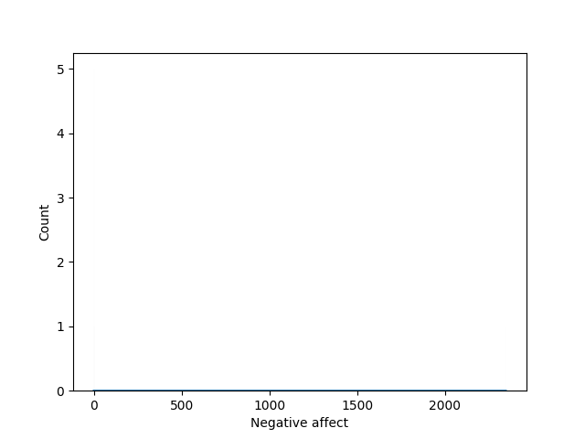

# Story for happiness

**The Quest for Happiness: Insights from the Global Happiness Dataset**

In a world often painted with hues of discontent and fleeting joys, the pursuit of happiness stands as an eternal quest for many. Yet, what if we had a map—crafted from data—that could illuminate the pathways to joy?

Once, a dataset named ‘happiness’ spanned across the digital archives of the globe, capturing the lives of individuals in 2,363 instances—each row a heartbeat, each column a facet of existence. What did this treasure trove unveil? Engaging merely on its surface was misleading; the real magic blossomed in its details.

To begin, the dataset recorded responses from various nations over many years, documenting sentiments and measures of wellbeing from 2005 to 2023. At heart, it revealed that happiness is a multi-layered experience, influenced by societal structures, economic capacity, and individual choices.

Among the insights, the “Life Ladder” emerged as the beacon of this narrative. On a scale from 0 to 10, people around the world ranked their happiness with an average score of approximately 5.48, suggesting a collective outlook hovering between moderate contentment and a yearning for more. With a minimum score of 1.28 and a maximum at 8.02, the variance spoke volumes; not everyone experiences happiness uniformly. What sparked this variance? That’s where the dataset’s rich tapestry began to unravel.

Economic security, represented through the “Log GDP per capita,” bore significance in boosting happiness. With the average log GDP recorded at 9.4, wealthier nations tended to correlate with higher occurrences of joy. Of course, this isn’t a linear relationship; the pain of poverty is typically felt acutely in low-income countries, where access to resources shapes the very foundation of happiness. 

Yet, happiness extends beyond mere economic stability; social support plays a pivotal role. The average rating of this dimension hovered just above average, reflecting an important cultural insight—community ties and the interpersonal connections fostered within them fortified our spirits. However, the weed of missing values threaded through this variable—the dataset recorded 13 missing entries—a reminder that not all voices resonate equally in this conversation.

Despite these threads of positivity, the data presented shadows to navigate through as well. The concept of freedom to make life choices was measured with intrigue, though its 36 missing entries hinted at a bureaucracy that might stifle personal autonomy in some countries. Meanwhile, sentiments toward generosity and perceptions of corruption threw spanners into the mix, with significant missing responses portrayed as the blurry side of societal happiness. Each missing value in “Generosity” suggested individuals struggling to find ways to connect beyond themselves, underscoring the complexity of crafting a fulfilling life amidst life's distractions and disillusions.

To add further depth to this narrative, emotional factors emerged, with positive and negative affect playing crucial roles. Responses indicated an average positivity rating that flirted with optimism but highlighted the stark realities, revealing that the shadows of negativity are also prevalent. With 24 missing values for positive emotions and 16 for negative emotions, it became apparent that honesty regarding our emotional weather varied significantly.

A small sample of countries like Argentina, Costa Rica, Brazil, Bolivia, and Bangladesh unveiled the contrasts in experience—different stories entwined with unique cultural tapestries and values. How do these nations navigate their unique socio-economic paths, and how do they articulate happiness? 

As we sifted through the data, we began to understand happiness as a puzzle—each piece contributing to a broader picture. There isn't a singular road to happiness; instead, numerous routes exist, shaped by culture, economy, and social ties. 

With this revelation, one thing became clear: if happiness is indeed a complex constellation, the stars that guide us toward joy are plentiful. The pursuit of happiness will always be a collective journey; our understanding, enhanced by such data, is but the first step. What remains is to embrace the diversity within this quest, weaving new narratives that honor each unique experience of happiness across the globe.

