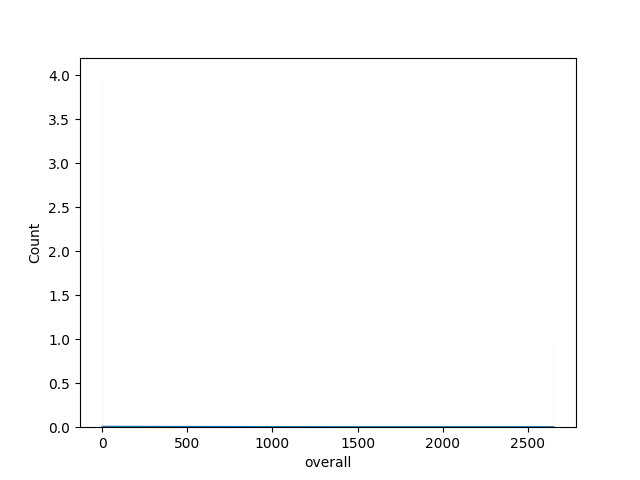
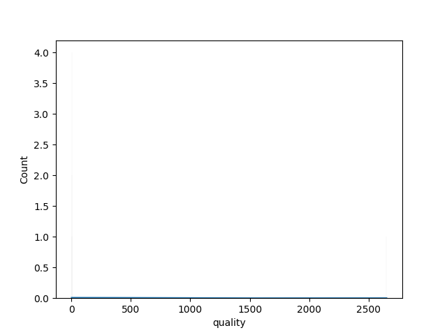
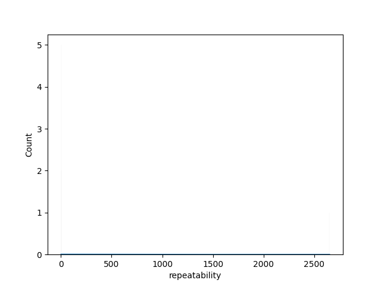

# Story for media

In a dimly lit corner of the digital realm, the ‘media’ dataset lay quietly, waiting for a storyteller to unravel its secrets. Composed of 2,652 unique entries, this dataset narrated tales of human expression, creativity, and satisfaction through films, shows, or other media types across varying languages and cultures.

As we delve into the essence of this data, an initial glance reveals both astounding completeness and intriguing gaps. Almost all columns brimmed with information—yet, like any great story marred by uncertainty, there were incidences of missing data. Particularly in the ‘date’ column, where 99 records cried out for context. And the ‘by’ field, which seemingly whispered stories from the creators behind the medium but stood starkly empty for 262 entries. These omissions hint at lost voices and stories that could have added depth to our understanding of the overall cultural tapestry being woven.

Our heroes— the ratings of ‘overall’, ‘quality’, and ‘repeatability’—tell their own tale. On average, the viewers bestowed an overall score of approximately 3.05 out of 5, a modest rating suggesting that while there were moments of brilliance, the media could leave audiences wanting more. This rating is consistent in its steadiness; the interquartile range hovering comfortably around 3.0, with the highest performances reaching a peak of 5.0. But what does this imply? Perhaps the offerings were acceptable, yet they lacked the flair or innovation to captivate an audience completely. 

Quality, on another note, stood slightly stronger, garnering an average of 3.21. Here, the storytelling embraced more commitment. The consistency in scores, with significant clustering around the solid middle range, reflects a landscape striving for excellence but still finding pitfalls in its delivery. The upper quartile reaching the realms of 4.0 suggests that while many productions earned praise, a proportion of them soared to resounding acclaim.

Intriguingly, the ‘repeatability’ score floundered, averaging at just 1.49—less than a mere 1.5 on a three-point scale. What might this presage? The steep drop indicates that, while individuals may appreciate the media in the moment, few would feel compelled to engage with it repeatedly. It raises contemplative questions: Was it the format? The plot? The characters? The fleeting entertainment value suggests that perhaps the creativity captured in these pieces was exciting yet ephemeral, a momentary thrill rather than a lasting connection.

As we shift our gaze toward the cultural dimensions of this dataset, the heartbeat of diversity pulses through the ‘language’ column. The creators crafted tales across five languages: English, Tamil, Telugu, Hindi, and Malayalam. Here is a beautiful mosaic of voices, each reflecting the nuances of its culture. In the insights gleaned from the date entries—including significant moments like May 21, 2006, or September 22, 2018—there’s an invitation to explore contextual influences that may have shaped the media landscape. Were the times of global uncertainty and the hunger for storytelling intermingling with the creative outputs captured within these dates?

Furthermore, the landscape of ‘media’ invites us to compare cultural production: How do Tamil stories differ in their storytelling, pacing, and emotional depth from English narratives? What distinct themes breathe life into Hindi cinema compared to the transcendence of Telugu dramas? With every analytical brush stroke, we paint a picture of adaptation, resilience, and a world illuminated by the nuances of culture.

In conclusion, the ‘media’ dataset serves as a rich palette of intrigue—a story waiting to unfold, layered with satisfaction and steeped in potential. Each figure, each missing entry, and each language underscores the idea that media is not just entertainment; it's a reflection of our collective experiences, aspirations, and imperfections. As we endeavor to understand it further, perhaps we learn not only about what we crave in our entertainment, but also about ourselves as we weave the threads of our narratives together.

